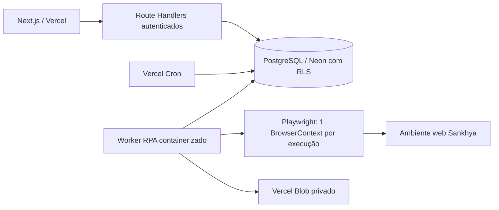

# Sankhya Browser Connector

## Objetivo

O conector consulta o DP Explorer pela interface web do Sankhya, sem API, e sincroniza colaboradores com o Vinculato. Ele é um módulo opcional por workspace. Não existe configuração, credencial, sessão, arquivo, log ou resultado global do Sankhya.

## Arquitetura

O Next.js somente valida, configura e enfileira. O cron somente cria jobs agendados. Playwright nunca roda dentro de uma requisição HTTP da Vercel. O worker containerizado usa lease, `FOR UPDATE SKIP LOCKED`, retry limitado e um contexto novo por execução.

O diretório `worker/sankhya` contém o Dockerfile e a raiz do repositório contém o `render.yaml`. A imagem pode rodar em Render, Cloud Run, Railway ou serviço equivalente que mantenha processo e Chromium ativos. O runtime precisa oferecer sandbox do Chromium para usuário não-root.

No Render, o processo é publicado como Web Service Starter na região Virginia. Essa escolha mantém o polling ativo sem suspensão e permite ao Render consultar `/health`, impedir a promoção de um deploy quebrado e reiniciar uma instância que perder acesso ao Neon. O endpoint de saúde não retorna credenciais nem dados de workspace. A concorrência inicial é `1`, adequada à memória do plano Starter com Chromium; aumente somente após observar consumo real.

## Multi-tenancy

- `workspaceId` é obtido da sessão no backend, nunca aceito como autoridade do frontend.
- Todas as tabelas filhas possuem `workspace_id`, FKs compostas e RLS forçado.
- O worker abre uma conexão escopada por workspace antes de reivindicar jobs.
- O lock parcial `fdp_sankhya_active_run_uq` impede dois runs ativos para `(workspace_id, integration_id)`.
- Workspaces distintos podem executar em paralelo até `FDP_SANKHYA_WORKER_CONCURRENCY`.
- Downloads ficam em diretório temporário aleatório criado por execução e removido no `finally`.
- Cookies, `localStorage`, `sessionStorage`, página, contexto e browser são destruídos depois do job, inclusive após falha.

## Feature flag por workspace

O módulo `sankhya_browser` é cadastrado pela migration, mas não faz parte de nenhum plano. A plataforma deve concedê-lo explicitamente em Configuração operacional para cada cliente piloto. Sem `fdp_workspace_module_grants.granted = 1`, o conector não aparece e os endpoints recusam a operação.

## Credenciais

Usuário e senha usam o cofre existente AES-256-GCM, com IV aleatório, tag de autenticação, AAD por canal e versão de chave. A senha nunca é retornada. A API pública devolve somente presença, fingerprint abreviada, versão, data de verificação e dica mascarada do usuário, como `ria********`.

O worker descriptografa a credencial depois de reivindicar o job e apenas para a execução. Logs, auditorias, eventos e erros passam por allowlists e sanitização. Recomenda-se criar no Sankhya um usuário dedicado de consulta, limitado ao DP Explorer e à rotina necessária.

Rotação usa `FDP_INTEGRATION_VAULT_KEYS` no formato `{"1":"base64","2":"base64"}` e `FDP_INTEGRATION_VAULT_KEY_VERSION`. A versão anterior permanece no keyring enquanto existirem envelopes cifrados com ela.

## Fluxo de execução

1. Usuário com `integrations.execute` inicia teste ou sincronização.
2. Backend resolve o workspace autenticado, valida grant, integração, configuração e credencial.
3. Run e job são criados atomicamente e retornam `202`.
4. Worker reivindica o job e cria browser/contexto/diretório exclusivos.
5. URL e cada navegação HTTPS passam por validação de rede pública e resolução DNS periódica.
6. Worker autentica, detecta CAPTCHA/MFA/bloqueio/senha expirada e abre o DP Explorer.
7. Executa a rotina aguardando estados observáveis, sem delay fixo de negócio.
8. Prioriza XLSX/CSV; valida extensão, assinatura, tamanho e conteúdo. A tabela é fallback limitado.
9. Dados crus são normalizados e validados antes do banco.
10. Colaborador é associado por `externalEmployeeId`, matrícula e, quando necessário, HMAC do CPF.
11. Mudanças são classificadas como nova, alterada, sem alteração ou inválida. Snapshot minimizado não guarda CPF completo.
12. Logs, contagens, auditoria e eventos são persistidos no workspace.
13. `finally` tenta logout, limpa storage/cookies, fecha contexto/browser e remove temporários.

## Estados e retry

Runs: `queued`, `running`, `authenticating`, `navigating`, `processing`, `extracting`, `importing`, `succeeded`, `partial`, `failed`, `requires_user_action` e `canceled`.

Retry só ocorre para falha transitória de rede, indisponibilidade ou timeout, até o máximo configurado (1 a 3). Login inválido, usuário bloqueado, senha expirada, falta de permissão, CAPTCHA, MFA e configuração insegura não são repetidos automaticamente.

## SSRF e navegação

- Configuração aceita somente HTTPS, sem credenciais na URL.
- Por padrão, somente `*.sankhya.com.br` é aceito.
- Hosts adicionais exigem `FDP_SANKHYA_BROWSER_ALLOWED_HOSTS` no web app e no worker.
- `localhost`, `.local`, metadata endpoints, IPs privados, loopback, link-local, CGNAT e faixas reservadas são bloqueados.
- DNS é revalidado durante a sessão; um origin não permanece confiável indefinidamente.
- `file:`, HTTP e protocolos executáveis são bloqueados.

## Seletores e manutenção

Seletores ficam em `lib/sankhya/selectors.ts`. Priorize roles e nomes acessíveis, labels, `aria-label`, texto estável e atributos semânticos. CSS é apenas fallback de login.

Para adicionar uma rotina: crie contrato próprio; adicione seletores centralizados; implemente navegação/extração sem acoplar DOM ao banco; crie normalizador, validação e importador idempotente; emita eventos minimizados; cubra sucesso, layout alterado, arquivo inválido e isolamento no mock.

Erros `SELECTOR_NOT_FOUND`, `DP_EXPLORER_NOT_FOUND` e `UI_CHANGED` são contados como possíveis quebras de layout. Recorrência em vários workspaces indica manutenção do conector, não erro do cliente.

## Diagnósticos e LGPD

Screenshot só é capturado após erro técnico. Campos de senha são mascarados e inputs/células são desfocados. O arquivo fica em Blob privado, com chave contendo workspace/integração/run, limite de 5 MB, retenção de 1 a 168 horas e leitura somente por PlatformAdmin. O worker remove objeto e metadado expirados.

Não são persistidos cookies, storage, senha, CPF completo no snapshot, dados bancários ou conteúdo bruto do download. Arquivos nunca são executados.

## Variáveis de ambiente

Web e worker:

- `DATABASE_URL`
- `FDP_INTEGRATION_VAULT_KEYS` ou `FDP_INTEGRATION_VAULT_KEY`
- `FDP_INTEGRATION_VAULT_KEY_VERSION`
- `FDP_PII_HASH_SECRET`
- `FDP_SANKHYA_BROWSER_ALLOWED_HOSTS`
- `BLOB_READ_WRITE_TOKEN`

Somente worker:

- `FDP_SANKHYA_WORKER_POLL_MS` (padrão 5000)
- `FDP_SANKHYA_WORKER_CONCURRENCY` (padrão 3, máximo 10)
- `PORT` para health check

`FDP_SANKHYA_BROWSER_ENDPOINT` pode fixar uma origem adicional operada centralmente.

## Deploy

1. Aplique `0038_sankhya_browser_connector.sql` pelo comando oficial.
2. Faça deploy do Next.js na Vercel.
3. Publique `worker/sankhya/Dockerfile` em serviço persistente.
4. Configure as mesmas chaves de cofre, banco, HMAC, Blob e allowlist nos dois runtimes.
5. Confirme `/health` do worker e o cron de integrações.
6. Conceda o módulo somente ao workspace piloto.
7. Cadastre URL, empresa, contexto, usuário dedicado e senha.
8. Execute Testar conexão; só depois execute sincronização.
9. Valide no ambiente real os textos/roles do DP Explorer e o arquivo exportado.

### Render

1. Crie um Blueprint apontando para o `render.yaml` da raiz e para a branch `main`.
2. Confirme o Web Service `vinculato-sankhya-worker`, plano Starter, região Virginia.
3. Preencha no primeiro sync os segredos marcados com `sync: false` usando exatamente os valores do ambiente Production da Vercel.
4. Aguarde build da imagem, instalação do Chromium e health check `/health` com status `ok`.
5. Não troque para plano Free: a suspensão do processo impede o consumo contínuo dos jobs.

## Testes e mock

`npm run test:sankhya` cobre cofre, máscara, SSRF, moeda brasileira, minimização de CPF, CSV, mock de autenticação, agendamento, RLS/lock e limpeza. `MockSankhyaSession` suporta sucesso, login inválido, MFA, CAPTCHA, timeout, seletor ausente e arquivo inválido.

Antes da produção é obrigatório teste assistido contra o ambiente Sankhya do cliente. O mock comprova nosso contrato; não comprova que a versão de UI instalada pelo cliente usa os mesmos labels, frames e formato de exportação.
